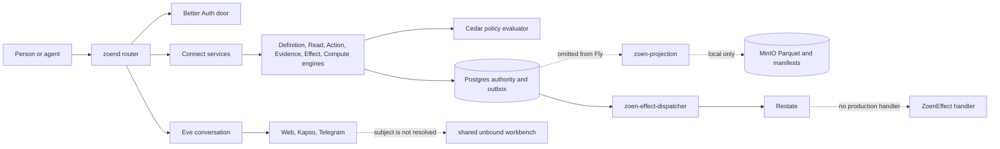

# Wave 0 synthesis

## Executive decision

Zoen has a sound authority core inside an incomplete product runtime. Postgres commits, immutable evidence, Action receipts, outbox writes, local projection, and effect state transitions already provide useful foundations. The production image does not run that whole system. It starts the dispatcher without a production `ZoenEffect` handler, omits projection, reports ready after one database integrity check, and lets Eve proceed without a resolved Membership.

The first implementation unit is **W1-01 Governed Publish**. `DefinitionEngine::publish` admits canonical content and writes authority state without calling its injected `PolicyEvaluator`. This is the earliest live authority violation and the correct pilot for the orchestrator. Projection is not the pilot because `zoen-projection` already passes the local `semantic-query` journey. Its missing production wiring remains urgent, but it is known integration work rather than the first unknown design boundary.

The final graph contains 44 units across five tracks and nine waves, including Wave 0. Each behavioral unit ends in one of eight product journeys. Static checks can support a verdict, but cannot replace the journey.

## Current system

### Overview

The public process is `zoen` in `apps/zoend`. It is both the Connect application and the HTTP router for the Better Auth door, Eve, identity administration, onboarding, workload ingress, packs, and legacy channel routes. Better Auth and Eve run as separate Node processes in the same Fly machine. Postgres is the authority store and auth database host. MinIO stores projection artifacts and Eve workbench disks. Restate is present only to run durable `ZoenEffect` calls.

The authority path is stronger than the deployed runtime. Definition, Action, evidence, and effect mutations use typed engines and Postgres stores. Most authority writes lock the tenant head, write immutable state and an outbox event in one transaction, then advance the head. The projection worker consumes that outbox into Parquet, manifests, and watermarks. The Fly image does not build or supervise the worker, so the local proof and the deployed process graph describe different products.



### Runtime flow

`deploy/fly/Dockerfile` builds `zoen` and `zoen-effect-dispatcher`. `deploy/fly/supervisord.conf` starts Postgres, Restate, MinIO, bucket setup, zoend, the dispatcher, agent credential maintenance, personal lake setup, Auth, and Eve. It does not start `zoen-projection`, `zoen-http-connector`, or a production `ZoenEffect` handler. The image does not contain the first two binaries.

`apps/zoend/src/main.rs::ready` calls only `PostgresAuthorityStore::verify_integrity`. The live `/ready` returning 200 therefore proves neither the release policy nor projection freshness, Restate registration, the handler, Auth, or Eve. It is a database integrity probe labeled as product readiness.

The local projection path is real. `apps/zoend/src/bin/zoen-projection.rs` opens a least-privilege connection and rejects a role that can insert authority claims. The worker validates outbox data, writes Parquet, publishes the manifest, and advances the watermark. `e2e/semantic-query.ts` covers object storage failure, isolation, idempotence, and rebuild. The missing work is packaging, role creation, discovery, supervision, and readiness.

The dispatcher calls `/restate/send/ZoenEffect/{tenant}:{effect}:{knowledge_sequence}/execute`. The only complete handler is `e2e/effect-worker.ts`. `e2e/explain.ts` assembles the dispatcher, Restate, a worker, a connector, and a provider for the journey. Production assembles only the first two pieces.

### Authority flow

`DefinitionServiceImpl::publish` resolves a Better Auth session and calls `DefinitionEngine::publish`. The engine verifies RFC 8785 canonical JSON, digest, and ontology semantics, then writes the revision, authority commit, outbox event, and head atomically. The `policy` field on `DefinitionEngine` is unused in this method. A valid same-World member can therefore publish meaning without Cedar deciding whether that principal may do so.

Activation does call Cedar. `DefinitionEngine::activate_revision` loads the candidate and active revision, checks the precondition and migration state, evaluates `zoen.definition.activate`, then persists the activation. Cedar resolves policy from a filesystem manifest keyed by definition digest and Action ID. The activation is governed, but ontology and policy are not one published object. `WorldRelease` does not exist yet.

`ActionEngine` has the strongest complete path. Propose validates typed inputs and state, approval revalidates delegation and preview, and Commit locks the authority head. `PostgresActionStore::commit` writes the receipt, semantic records, effects, outbox, and head in one transaction. Replay uses `OperationId`. `zoen.world.invite` breaks the boundary because `apply_world_invite` creates an identity store that opens a separate transaction before the Action commit finishes.

`ReadEngine` executes a raw page before it evaluates Cedar for each result. It can return a sparse page with the executor's original cursor. The protocol calls the cursor opaque, but the implementation passes a `String` through. The final design must authorize before public page assembly and seal the cursor to Membership, query, release, and budget.

Evidence persistence is immutable, atomic, and idempotent. Admission is too broad. `WorldServiceImpl::record_evidence` accepts a draft from any valid tenant session without a source-bound credential or Cedar decision. Effect reads have the inverse problem. `EffectServiceImpl::get_effect` accepts a tenant session and exposes the raw effect payload. Computation uses Wasmtime limits supplied by the client instead of a server-owned budget class.

### Identity and conversation flow

The identity data model already separates `ExternalSubject`, verified binding, Account, and Membership. `SessionDoor` verifies Better Auth sessions, and the direct session exchange can resolve a trusted context for a declared tenant. The conversation path does not use that model consistently.

The web Eve channel authenticates the Better Auth user. It attaches a Membership only when `x-zoen-tenant`, a usable zoend URL, and an opaque token are present. Fly sets `ZOEN_ZOEND`, while Eve reads `ZOEN_ZOEND_BASE_URL` and otherwise falls back to the wrong local port. An authenticated conversation can therefore continue without a Membership.

Telegram verifies the provider webhook secret and Eve separates conversation sessions by Telegram chat. Kapso verifies its webhook and preserves the WhatsApp thread for replies. Neither adapter resolves the provider subject through `ChannelBinding` to Account and Membership. Both can reach `sandbox.ts`, which maps missing membership to the literal `"unbound"`. Workbench disks and VMs are otherwise keyed correctly by Membership, so the unsafe fallback defeats a sound partitioning design.

Most Eve tools read `ZOEN_BEARER`, `ZOEN_TENANT`, and `ZOEN_ZOEND` from process-global environment. Fixed operation and proposal IDs are derived from the Action ID. The isolate wrapper has a stronger Membership-specific `HostCredential`, but the standard tools do not use a per-turn capability. The target boundary is one immutable `TurnCapability` resolved at ingress and passed to every tool and delivery call.

### Verification flow

`e2e/run.sh` registers 18 scenarios. Fifteen are live and three require external fiscal credentials. CI runs 12 live scenarios. It omits `cedar-object-projection`, `commercial-identity`, and `dirty-quote`. The build job compiles four debug binaries but never builds or runs `deploy/fly/Dockerfile`. Existing green checks cannot prove the one-Fly product.

The current browser environment has Chrome and CDP tooling, but no live attachable CDP session was found during Wave 0. No token, cookie, or conversation was inspected. The first browser unit must attach to the user's existing authenticated browser. It must fail closed instead of starting a clean profile or relogging either Telegram account.

## Boundaries that must change

| Boundary | Current truth | Required truth |
| --- | --- | --- |
| Publication | Canonical admission followed by an ungoverned authority write | Cedar permits `zoen.definition.publish` and its evidence is stored with the publication |
| Release | Active `DefinitionRevision` plus a boot policy manifest | One immutable `WorldRelease` binds ontology, policy, executors, and components |
| Query | Storage page first, Cedar filter second, raw cursor passthrough | Authorization precedes public page assembly and the server seals the cursor |
| Evidence | Any valid World session can submit a shaped draft | A published source capability binds the credential, source, shape, and release |
| Effects | Same-World session can read raw payload | A person sees sanitized status; only the executor or reconciler sees payload |
| Compute | The client chooses numeric ceilings | The server resolves a `BudgetClass` from release and policy |
| Identity ingress | Provider subject becomes an Eve principal | `ChannelBinding` resolves provider subject to Account and Membership |
| Eve tools | Process environment supplies authority | A short `TurnCapability` supplies authority and operation identity |
| Workbench | Missing Membership becomes shared `unbound` | No Membership means no workbench and a clear linking path |
| Delivery | Provider thread is remembered, but authority is absent | The verified ingress binding fixes the only permitted return channel |
| Durability | Eve owns sessions, Restate exists, delivery pieces are split | Eve owns conversation; Restate runs only a complete production `ZoenEffect` path |
| Readiness | One Postgres check returns ready | Release, policy, projection, handler, Eve, Auth, and storage gates all pass |

## Where the system lives

| Area | Paths |
| --- | --- |
| Kernel types and identity | `crates/zoen-core/src/lib.rs`, `crates/zoen-core/src/identity.rs`, `crates/zoen-core/src/effect.rs` |
| Authority engines | `crates/zoen-engine/src/lib.rs`, `action.rs`, `read.rs`, `computation.rs`, `evolution/activation.rs` |
| Postgres, Cedar, projection ports | `crates/zoen-adapters/src/authority_store.rs`, `action_store/commit.rs`, `identity_store.rs`, `cedar.rs` |
| Public composition | `apps/zoend/src/main.rs`, `service.rs`, `world_service.rs`, `effect_service.rs`, `computation_service.rs` |
| Runtime workers | `apps/zoend/src/bin/zoen-projection.rs`, `zoen-effect-dispatcher.rs`, `zoen-http-connector.rs` |
| Better Auth | `apps/auth/src/auth.ts`, `server.ts`, `html.ts` |
| Eve and ingress | `apps/conversation/agent/channels/eve.ts`, `telegram.ts`, `kapso.ts` |
| Eve authority and workbench | `apps/conversation/agent/kernel-action.ts`, `sandbox/`, `tools/` |
| One-Fly runtime | `deploy/fly/Dockerfile`, `supervisord.conf`, `fly.toml`, `init/001-roles.sh` |
| Journey registry and CI | `e2e/run.sh`, `e2e/*.ts`, `.github/workflows/verify.yml` |

## Final journey matrix

These eight journeys replace scenario count as the product release contract. A journey can reuse lower-level scenarios, but must run against the production-shaped image when marked as a release gate.

| ID | Journey | Actors and path | Positive proof | Negative and recovery proof |
| --- | --- | --- | --- | --- |
| J1 | Governed release | Builder and World owner through CLI or Connect | Candidate publication stores policy evidence; owner activates one `WorldRelease`; digest binds ontology, policy, executors, and components | Same-World non-builder and missing policy both fail before any commit; stale activation fails |
| J2 | Governed knowledge | Person asks Eve to remember a fact | Eve proposes and commits; one receipt and attributed evidence become queryable and explainable | A normal member cannot write raw evidence; Eve does not claim memory before the receipt |
| J3 | Shared authority | Family member A proposes; family member B decides | Decision uses B's principal; Commit creates one receipt; invite and Membership materialize atomically | Self-approval outside policy, revoked Membership, and failed Commit create no partial Membership |
| J4 | Governed clinic query | Clinic human and clinic agent | Both read only permitted patient objects, page with sealed cursors, run server-budgeted compute, and explain the policy | Cursor replay under another Membership or release fails; denied objects never affect public pagination; budget cannot be raised by the caller |
| J5 | Bound conversation | Web A, WhatsApp, Telegram A, and Telegram B | Every ingress resolves Account, Membership, World, release, and origin delivery; linked Web A and Telegram A share authorized continuity | Telegram B cannot read A's receipts or workbench and never receives A's reply; webhook replay does not create a second operation |
| J6 | Durable automation | Person asks Eve for two reminders | Generic Automation creates two `ExecutorCall` records; Restate survives restart; each reminder reaches its verified origin once | Kernel contains no Telegram, Kapso, WhatsApp, reminder Action ID, or provider branch; ambiguous send is reconciled without channel fallback |
| J7 | Agent parity | Factory operator and MCP workload | CLI, Connect, MCP, and Eve discover the same catalog and produce the same proposal, decision, receipt, and explanation | A workload outside its Membership, release, or budget is denied by the same policy as a human |
| J8 | Production recovery | Operator against the one-Fly image | The image boots from empty development state, reaches projection watermark, registers `ZoenEffect`, passes all product dependencies, restarts, and recovers | Stopped projection, missing handler, stale release, broken Eve, or broken Auth makes `/ready` fail; authority remains immutable |

### Channel identity proof for J5

| Participant | Required binding | Real action | Backend evidence | Visible evidence |
| --- | --- | --- | --- | --- |
| Web A | Better Auth A to Account A to Membership A | Start a conversation and commit a governed memory | `TurnCapability` records Account A, Membership A, active release, and operation | The receipt appears in the same authenticated workbench |
| Telegram A | Telegram subject A to a verified binding chosen for fixture A | Send nonce A from the visible Telegram A account | Audit records binding A, World A, operation A, and delivery A | Reply appears only in Telegram A |
| Telegram B | Telegram subject B to Account B and Membership B | Revalidate the visible account, then send nonce B | Audit records binding B, World B, operation B, and delivery B | Reply appears only in Telegram B; nonce A and receipt A are absent |
| WhatsApp | Kapso `waId` to a verified ChannelBinding | Send a real message in the test thread | Signature, binding, operation, and delivery are recorded | Reply appears in the same thread and not in either Telegram account |
| Restart | Existing delivery intents for A and B | Restart after commit and around provider send | One logical operation and one stable delivery intent survive | Each origin sees at most one logical reply |

If both Telegram accounts use one browser profile, the journey serializes the sends and revalidates the visible identity before each action. Parallel browser actions are forbidden in that configuration.

## Executable unit graph

Tracks use the names from `overview.md`.

- `runtime-truth` owns the one-Fly artifact, workers, readiness, and CI.
- `world-authority` owns `WorldRelease`, policy, actions, evidence, query, compute, and automation.
- `identity-eve` owns Account, Membership, per-turn authority, Auth, Eve, and channels.
- `agent-surfaces` owns CLI, Connect, MCP, packs, and catalog parity.
- `integration` owns browser control, cross-track journeys, PR disposition, audits, and deployment.

| ID | Unit | Track | Dependencies | Size | Journey | Wave |
| --- | --- | --- | --- | --- | --- | --- |
| W0-01 | Map runtime, image, CI, projection, effects, and PR frontier | runtime-truth | none | M | Meta | 0 |
| W0-02 | Map kernel, authority, policy, query, evidence, effects, and compute | world-authority | none | M | Meta | 0 |
| W0-03 | Map Better Auth, Eve, identity, workbench, Kapso, and Telegram | identity-eve | none | M | Meta | 0 |
| W0-04 | Synthesize boundaries, journeys, unit graph, PRs, and pilot | integration | W0-01, W0-02, W0-03 | M | Meta | 0 |
| W1-01 | Govern definition Publish with Cedar and persisted policy evidence | world-authority | W0-04 | L | J1 | 1 |
| W1-02 | Package and supervise projection with a least-privilege database role | runtime-truth | W1-01 | M | J8 | 1 |
| W1-03 | Package and register a production `ZoenEffect` handler | runtime-truth | W1-01 | L | J6, J8 | 1 |
| W1-04 | Fix Eve internal URLs and delete legacy `/channels/*` and `conversation_stage` | runtime-truth | W1-01 | M | J5, J8 | 1 |
| W1-05 | Attach CDP to the existing browser and record the two Telegram identities without secrets | integration | W1-01 | S | J5 | 1 |
| W1-06 | Make `/ready` check policy, release, projection, Restate, handler, Eve, Auth, and storage | runtime-truth | W1-02, W1-03, W1-04 | L | J8 | 1 |
| W1-07 | Build and run the one-Fly image in CI and restore all 15 live scenarios | integration | W1-02, W1-03, W1-04, W1-06 | L | J1, J8 | 1 |
| W2-01 | Add branded `WorldId`, `ReleaseDigest`, catalog digests, and `WorldRelease` types | world-authority | W1-01 | M | J1 | 2 |
| W2-02 | Store immutable release candidates and their four content-addressed catalogs | world-authority | W2-01 | L | J1 | 2 |
| W2-03 | Publish Cedar bundles inside the candidate and remove boot policy as authority | world-authority | W2-02 | L | J1 | 2 |
| W2-04 | Preview, decide, and atomically activate one `WorldRelease` | world-authority | W2-03 | L | J1 | 2 |
| W2-05 | Implement `Discover`, `Query`, `Propose`, `Decide`, `Commit`, `Explain`, and `Execute` on one catalog | world-authority | W2-04 | L | J1, J7 | 2 |
| W2-06 | Authorize before page assembly and seal cursors to Membership, query, release, and budget | world-authority | W2-04 | L | J4 | 2 |
| W2-07 | Replace client computation limits with release-owned `BudgetClass` | world-authority | W2-04 | M | J4, J7 | 2 |
| W3-01 | Align Account, ExternalSubject, ChannelBinding, Membership, and World storage | identity-eve | W2-04 | L | J5 | 3 |
| W3-02 | Add one-time `LinkIntent` confirmed by Better Auth and channel possession | identity-eve | W3-01 | L | J5 | 3 |
| W3-03 | Add `SessionBroker` and immutable, short-lived `TurnCapability` | identity-eve | W3-01, W3-02 | L | J5 | 3 |
| W3-04 | Complete login, personal World bootstrap, Membership selection, and CLI device flow | identity-eve | W3-02, W3-03 | L | J5, J7 | 3 |
| W3-05 | Enforce Eve session ownership and delete the `unbound` workbench state | identity-eve | W3-03, W3-04 | M | J5 | 3 |
| W3-06 | Pass `TurnCapability` to every tool and replace ambient credentials and fixed IDs | identity-eve | W2-05, W3-03, W3-05 | L | J2, J5 | 3 |
| W4-01 | Bind evidence admission to a published source capability and claim shape | world-authority | W2-04, W3-03 | L | J2, J4 | 4 |
| W4-02 | Materialize invite and Membership in the same authority transaction | world-authority | W2-04, W3-01 | L | J3 | 4 |
| W4-03 | Converge proposal, decision, commit, and receipt on the seven-verb contract | world-authority | W2-05, W3-03 | L | J2, J3, J7 | 4 |
| W4-04 | Split sanitized public effect status from executor and reconciler payload access | world-authority | W2-04, W3-03 | M | J6 | 4 |
| W4-05 | Project and explain principal, release, policy, source, effect, and causal attribution | world-authority | W1-02, W4-01, W4-02, W4-03, W4-04 | L | J2, J3, J4 | 4 |
| W5-01 | Finish Eve's Membership workbench for knowledge, evidence, approvals, receipts, channels, and roles | identity-eve | W3-04, W4-05 | L | J2, J3, J5 | 5 |
| W5-02 | Derive Eve dynamic tools and approval resumption from the active release | identity-eve | W2-05, W3-06, W4-03 | L | J2, J3 | 5 |
| W5-03 | Resolve Telegram ingress to ChannelBinding and return only through its origin | identity-eve | W1-05, W3-02, W3-03, W3-05 | L | J5 | 5 |
| W5-04 | Resolve Kapso ingress to ChannelBinding and persist its operational state | identity-eve | W3-02, W3-03, W3-05 | L | J5 | 5 |
| W5-05 | Prove progressive consent and cross-channel continuity for Web A, WhatsApp, Telegram A, and Telegram B | integration | W5-01, W5-02, W5-03, W5-04 | L | J5 | 5 |
| W6-01 | Add generic `AutomationDefinition` and content-addressed `ExecutorCall` | world-authority | W2-04, W2-05, W4-03 | L | J6 | 6 |
| W6-02 | Execute generic calls through the production Restate `ZoenEffect` path | runtime-truth | W1-03, W4-04, W6-01 | L | J6, J8 | 6 |
| W6-03 | Add an origin-bound delivery ledger, retry identity, and ambiguous-send reconciliation | identity-eve | W5-03, W5-04, W6-02 | L | J5, J6 | 6 |
| W6-04 | Prove two reminders, restart, retry, and one logical delivery per origin | integration | W5-05, W6-03 | L | J6 | 6 |
| W7-01 | Generate coherent CLI and Connect contracts from the governed catalog | agent-surfaces | W2-05, W4-03, W4-05 | L | J7 | 7 |
| W7-02 | Add an inbound MCP server over the same kernel and catalog | agent-surfaces | W7-01 | L | J7 | 7 |
| W7-03 | Converge ZoenPack on release preview and prove clinic and factory Worlds | agent-surfaces | W2-07, W4-01, W7-02 | L | J4, J7 | 7 |
| W8-01 | Prove restart, rebuild, least privilege, observability, and dependency failure behavior | integration | W1-07, W4-05, W6-04, W7-03 | L | J8 | 8 |
| W8-02 | Run all eight journeys on one production-shaped artifact and complete the independent audit | integration | W8-01 | L | J1-J8 | 8 |
| W8-03 | Resolve every initial PR, reconcile the ledger and license, then deploy the verified artifact | integration | W8-02 | M | J1-J8 | 8 |

### Critical path

```text
W0-04
-> W1-01 governed Publish pilot
-> W2-01..W2-05 WorldRelease and catalog
-> W3-01..W3-06 identity and TurnCapability
-> W4-03 governed verbs
-> W5-02 dynamic Eve tools
-> W6-01..W6-04 automation and delivery
-> W7-01..W7-03 agent parity
-> W8-01..W8-03 release and deploy
```

Runtime work W1-02 through W1-07 runs after the pilot and before release-dependent integration. Query and compute work W2-06 and W2-07 can run beside identity. Telegram and Kapso can run in parallel only after `TurnCapability` and the removal of `unbound`. Browser actions against two accounts remain serialized until W1-05 proves separate browser contexts.

## Open PR disposition

No open PR has a current ledger verdict against this graph. Green GitHub checks do not make any PR mergeable yet.

| PR | Classification | Disposition | Reason and target unit |
| --- | --- | --- | --- |
| #601 | Replace | Supersede after extracting the verified external-subject intent | It propagates channel identity, but uses a reversible machine admin token and races on Membership-scoped credential state. Rebuild under W3-02 and W3-03. |
| #600 | Drop | Close without restack after a replacement exists | It replaces Restate with Rivet, rewrites a migration baseline, adds unit-style tests, and conflicts with the product law. |
| #598 | Replace | Supersede with generic automation | It hardcodes `personal.createReminder`, `personal.dueAt`, and delivery semantics in the kernel. Replace in W6-01. |
| #597 | Keep and restack | Preserve the direct Connect transport idea, then rebuild IDs and authority context | Moving Eve away from CLI spawn is correct. Fixed IDs and the missing journey are not. Target W3-06 and W7-01. |
| #593 | Regenerate | Recreate in one npm lockfile cohort | Land with #521 and #523 only after application typecheck and the image build pass. |
| #533 | Coordinate | Recreate with #532 as one toolchain unit | Rust image version must match `rust-toolchain.toml`, CI, protobuf tooling, and the release image. |
| #532 | Coordinate | Recreate with #533 as one toolchain unit | Node image changes must match Auth, Eve, root build, native dependencies, and image proof. |
| #531 | Safe cohort | Rebase and verify with #519, #522, #525, and #526 | A leaf dependency update. It still needs the current journey and image gates. |
| #530 | Blocked pair | Replace together with #528 | `connectrpc` and `buffa` versions must move in one dependency graph. Individual heads have incompatible types. |
| #529 | Blocked pair | Replace together with #527 | `parquet` and `object_store` must use the versions selected by DataFusion and the projection worker. |
| #528 | Blocked pair | Replace together with #530 | The generated Connect boundary cannot carry two `buffa` versions. |
| #527 | Blocked pair | Replace together with #529 | The current update conflicts with the Parquet and DataFusion object-store graph. |
| #526 | Safe cohort | Rebase and verify with the safe dependency cohort | Restate remains the correct product dependency. Verify the production handler and restart journey. |
| #525 | Safe cohort | Rebase and verify with the safe dependency cohort | Action version change is mechanical, but the new image CI gate must prove it. |
| #524 | Defer | Recreate after W1-07 owns a real image build | Updating setup-buildx before CI builds the product image provides no product proof. |
| #523 | Regenerate | Recreate in the npm lockfile cohort | Type packages and Zod should share one regenerated lockfile and app typecheck. |
| #522 | Safe cohort | Rebase and verify with the safe dependency cohort | Action version change is mechanical, but all workflows must pass together. |
| #521 | Regenerate | Recreate in the npm lockfile cohort | Node types must match the chosen runtime versions and all TypeScript applications. |
| #520 | Defer | Recreate after W1-07 owns a real image build and push artifact | The change becomes useful only when CI proves the Docker artifact. |
| #519 | Safe cohort | Rebase and verify with the safe dependency cohort | Artifact download is mechanical, but must be checked against the final CI artifact layout. |

The safe cohort is #519, #522, #525, #526, and #531. The npm cohort is #521, #523, and #593. Neither cohort should land before W1-01 validates the orchestrator's brief, worker, verifier, ledger, and merge contract.

## Gaps and risks

1. The bootstrap rule for the first `WorldRelease` is not specified. W2-03 must define a planted release or an explicit owner ceremony. It must not create a permanent superuser bypass.
2. Wave 0 could not attach to a live browser. W1-05 must discover the existing session without reading cookies, exporting tokens, or relogging users.
3. The fixture relationship among Web A, Telegram A, and Telegram B is not documented. J5 assumes Web A and Telegram A may be linked and Telegram B belongs to another Account and World. W1-05 records the real fixture before any message is sent.
4. Telegram groups have separate chat and sender identities. The launch path should remain private-chat only until a governed group membership design exists.
5. `SourceCapability` still needs one exact owner. The likely design binds a source credential to a published source and permitted claim shapes. W4-01 must decide whether every source is also an executor.
6. The production `ZoenEffect` handler has no selected host process. It belongs to Ontology inside `apps/zoend`, not to a fourth product. W1-03 must choose a binary and registration lifecycle that survives restart.
7. Policy is keyed by definition digest and Action ID. Governed Publish needs a candidate policy before the candidate exists in authority storage. The pilot uses the existing evaluator contract and preinstalled candidate policy. W2 replaces the source with the candidate's policy bundle in one change.
8. Current journeys use debug binaries and several compose topologies. W1-07 must make the image the artifact under test instead of adding another proxy check.
9. `e2e/run.sh` still runs `cargo test`, and Rust sources contain `#[cfg(test)]` modules. Units that touch those areas must move behavioral proof into journeys and remove local unit tests. A broad unrelated purge would make the pilot unreviewable.
10. Projection tenant discovery is a static environment list. W2-04 and W1-02 must converge on active Worlds without a global shared writer or periodic full scan.
11. Delivery APIs are at least once at provider boundaries. J6 can promise one logical delivery only when the provider offers an idempotency key or reconciliation can distinguish accepted from unknown sends.
12. The current repository advertises conflicting MIT and Apache licensing. W8-03 must select and apply one license before release.
13. Graphite stack metadata was unavailable from `main`. The coordinator must recover the frontier in an isolated integration worktree before retargeting or landing any PR.
14. Forty implementation units remain after Wave 0. The coordinator must stop opening new work near the program budget limit and integrate the verified frontier. Ambition does not justify an ever-growing unmerged queue.

## Pilot brief

### ID

`W1-01-governed-publish`

### Goal

Make definition publication a governed authority operation. A policy-permitted builder publishes one canonical definition and receives durable policy evidence. A denied principal or missing policy creates no authority commit, revision, outbox row, or head movement.

This pilot validates the full orchestration loop before parallel implementation starts. The loop is brief, isolated branch, implementation, journey, independent verification, ledger verdict, and merge.

### User outcome

A World owner can trust that no member changes the World's published meaning merely because the member has a valid session. A maintainer gets one policy pattern for Publish that survives the later move from boot policy to `WorldRelease` policy.

### Data shape

The implementation starts from these concepts:

```text
DefinitionPublication {
  context
  candidate DefinitionReference
  canonical definition
  policy PolicyEvidence
  projection event
}

PolicyOperation::PublishDefinition
ActionId = "zoen.definition.publish"
ResourceId = candidate DefinitionId
```

`PolicyEvidence` contains the policy ID, revision, digest, and determining policies. The store persists the evidence in the same transaction as the revision and authority commit. Do not store a boolean `authorized` flag or reconstruct policy evidence after Commit.

### Runtime flow

1. `DefinitionServiceImpl::publish` resolves the trusted session and rejects tenant substitution.
2. `DefinitionEngine::publish` admits canonical JSON and builds the candidate `DefinitionReference`.
3. Delegation and Cedar evaluate `zoen.definition.publish` for the candidate digest and definition resource.
4. Deny and evaluation error return before opening the publication transaction.
5. Permit produces `PolicyEvidence` and an admitted publication.
6. `PostgresAuthorityStore` stores the revision, policy evidence, authority commit kind, projection event, and head atomically.
7. Replaying identical content returns the same revision and does not create a second commit. The replay must not let a now-denied caller use an old permit silently.

### Scope

The worker may change only the publication call path, the Cedar operation mapping, one new forward migration if persistence needs it, policy fixtures required by live journeys, and the `definition-publication` journey. Expected paths are:

- `crates/zoen-engine/src/action.rs`
- `crates/zoen-engine/src/lib.rs`
- `crates/zoen-engine/src/admission.rs`
- `crates/zoen-adapters/src/cedar.rs`
- `crates/zoen-adapters/src/authority_store.rs`
- `crates/zoen-adapters/migrations/`
- `apps/zoend/src/service.rs`
- `e2e/definition-publication.ts`
- live journey Cedar and policy-manifest fixtures that publish definitions
- `deploy/fly/policies.json` only for the two definitions planted by the Fly image

The worker must name every additional file before editing it in the unit report.

### Acceptance

1. A same-World builder with a permitting candidate policy publishes the canonical definition.
2. The stored publication records exact `PolicyEvidence` in the authority transaction.
3. A valid same-World principal without the builder permission receives `PermissionDenied`.
4. A candidate with no installed policy fails closed. It does not fall back to activation policy or membership alone.
5. Denial and missing policy leave `authority_commits`, `definition_revisions`, `projection_outbox`, and `authority_heads` unchanged.
6. Tenant substitution remains denied by `SessionExchange`.
7. Identical replay returns the original revision and does not add a commit, while still evaluating the caller's current authority.
8. Outbox failure rolls back revision, policy evidence, commit, and head together.
9. Restart returns the exact revision and its policy evidence.
10. Every existing live journey still passes after its policy fixture declares Publish explicitly.
11. No unit test, mock, fake, stub, `vi.mock`, linter bypass, `unwrap`, compatibility alias, dual policy read, or rewritten applied migration is added.

### Journey

Extend `e2e/definition-publication.ts` rather than creating a unit test.

The journey plants two same-World personas. The builder has `zoen.definition.publish`; the observer does not. It proves allow, deny, missing policy, tenant substitution, idempotent replay, transactional rollback, restart recovery, and policy evidence from Connect through Postgres. The journey artifact records the policy digest and all assertion names without tokens or tenant secrets.

### Verification

Run these checks from a clean pilot worktree:

```text
just e2e definition-publication
just verify
git diff --check
```

The independent verifier reads the migration, checks the policy decision occurs before the store write, inspects the negative database assertions, and reruns `just e2e definition-publication` at the reported head SHA. A compiler-only result is not a verdict.

### Exclusions

- Do not implement full `WorldRelease` in this unit.
- Do not package projection or change readiness.
- Do not replace Restate or touch conversation delivery.
- Do not preserve an ungoverned Publish alias.
- Do not add a second policy store. The existing evaluator remains the single source until W2-03 replaces its boot source atomically.
- Do not merge, deploy, close, or retarget any existing PR from the worker.

### Required report

The worker reports branch, head SHA, exact commands, journey artifact, files changed, database shape, verdict, deviations, and follow-up risks. The verifier reports `journey-verified`, `not-verified`, or `blocked` for that exact SHA. Only the coordinator may merge a current `journey-verified` SHA.

## Verification of this synthesis

This report used the three Wave 0 explorer findings and checked the following facts directly on `main` at `d530f622141149f564a22e2f03051c34690426f4`:

- `DefinitionEngine::publish` does not call `self.policy`.
- `PolicyOperation` has no Publish variant.
- `CedarPolicyEvaluator` keys policy by definition digest and Action ID.
- `build_routers` mounts `conversation_stage` and legacy messaging ingress.
- `supervisord.conf` omits projection and a `ZoenEffect` handler.
- `Dockerfile` builds only `zoen` and `zoen-effect-dispatcher` from Rust.
- `/ready` checks only authority-store integrity.
- Fly sets `ZOEN_ZOEND`, while Eve membership resolution reads `ZOEN_ZOEND_BASE_URL`.
- `sandbox.ts` and `membership.ts` contain the `unbound` fallback.
- CI lists 12 of the 15 live journeys and does not build the Fly image.
- GitHub reported exactly 20 open PRs when the frontier was read.

Read-only commands included `rg`, `sed`, `find`, `git status`, `git rev-parse`, and `gh pr list`. No branch, PR, message, deployment, browser session, or runtime state changed.

The graph follows Foundational Thinking by placing governed Publish and `WorldRelease` before new product paths. Sequence Work into Verifiable Units made each unit end in a named journey. Outcome-Oriented Execution deletes boot authority, legacy channels, ambient credentials, and `unbound` in their caller-migration waves instead of preserving aliases. Experience First keeps the eight gates centered on what a person or agent can observe. Prove It Works makes the production image and real browser identities the final evidence.
